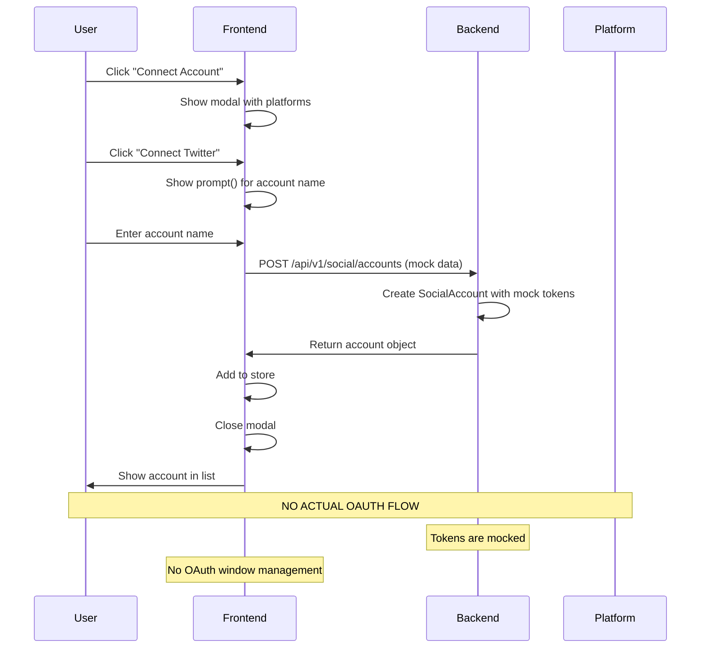

# Social Account Connection Flow - Buffer-Level Redesign Specification

**Document Version**: 1.0  
**Date**: 2026-02-27  
**Status**: Design Phase  
**Priority**: P0 - Critical  

---

## Executive Summary

This document provides a comprehensive analysis and redesign specification for the social account connection flow to achieve Buffer.com-level UX and reliability. The current implementation has significant gaps in user experience, security, error handling, and state management.

**Current State**: Basic OAuth placeholder with minimal error handling  
**Target State**: Production-grade OAuth flow with comprehensive security, error handling, and Buffer-level UX

---

## Table of Contents

1. [Current Flow Audit](#1-current-flow-audit)
2. [Ideal Flow Architecture](#2-ideal-flow-architecture)
3. [API Contract Definition](#3-api-contract-definition)
4. [UI State Machine](#4-ui-state-machine)
5. [Security Validation Checklist](#5-security-validation-checklist)
6. [Implementation Task Breakdown](#6-implementation-task-breakdown)
7. [Risk Assessment](#7-risk-assessment)

---


## 1. CURRENT FLOW AUDIT

### 1.1 Entry Points

**Frontend Entry Points:**
- `ConnectedAccountsPage` (`apps/frontend/src/pages/social/ConnectedAccounts.tsx`)
  - "Connect Account" button opens modal
  - Modal shows platform selection
  - `ConnectButton` component handles connection initiation

**Current Flow:**
```
User clicks "Connect Account" 
  → Modal opens with platform list
  → User clicks platform button (e.g., "Connect Twitter")
  → ConnectButton.handleConnect() executes
  → Shows browser prompt() for account name (MOCK)
  → Calls useSocialAccountStore.connectAccount()
  → POST /api/v1/social/accounts with mock data
  → Account added to store
  → Modal closes
```

### 1.2 Files Involved

**Frontend:**
- `apps/frontend/src/pages/social/ConnectedAccounts.tsx` - Main page
- `apps/frontend/src/components/social/ConnectButton.tsx` - Connection trigger
- `apps/frontend/src/components/social/AccountCard.tsx` - Account display
- `apps/frontend/src/store/social.store.ts` - State management
- `apps/frontend/src/services/social.service.ts` - API calls
- `apps/frontend/src/types/social.types.ts` - Type definitions

**Backend:**
- `apps/backend/src/controllers/OAuthController.ts` - OAuth flow handler
- `apps/backend/src/controllers/SocialAccountController.ts` - Account CRUD
- `apps/backend/src/routes/v1/oauth.routes.ts` - OAuth routes
- `apps/backend/src/routes/v1/social.routes.ts` - Social account routes
- `apps/backend/src/services/OAuthService.ts` - OAuth logic
- `apps/backend/src/services/SocialAccountService.ts` - Account management
- `apps/backend/src/services/oauth/OAuthManager.ts` - Provider management
- `apps/backend/src/providers/SocialPlatformProvider.ts` - Provider interface
- `apps/backend/src/models/SocialAccount.ts` - Data model

### 1.3 Current OAuth Flow (Backend)

**Available Routes:**
```
GET  /api/v1/oauth/platforms              - List available platforms
GET  /api/v1/oauth/:platform/url          - Get OAuth URL (frontend-initiated)
GET  /api/v1/oauth/:platform/authorize    - Redirect to OAuth (backend-initiated)
GET  /api/v1/oauth/:platform/callback     - OAuth callback handler
```

**OAuth Flow Implementation:**
1. Frontend calls `/oauth/:platform/url`
2. Backend generates OAuth URL with state parameter
3. Backend stores state in memory (OAuthManager)
4. Frontend receives URL
5. Frontend redirects user to OAuth URL
6. User authorizes on platform
7. Platform redirects to `/oauth/:platform/callback`
8. Backend validates state parameter
9. Backend exchanges code for tokens (MOCK)
10. Backend fetches user profile (MOCK)
11. Backend creates/updates SocialAccount
12. Backend redirects to frontend with success/error

### 1.4 Weak Points (CRITICAL ISSUES)

**1. No Real OAuth Implementation**
- Token exchange is mocked
- User profile fetch is mocked
- No actual platform API calls
- Comment: `// TODO: Implement OAuth flow`

**2. State Management Issues**
- State stored in memory (lost on server restart)
- No Redis/database persistence
- No state expiration cleanup
- No replay attack prevention beyond timestamp

**3. Frontend UX Gaps**
- Uses browser `prompt()` for mock connection
- No loading states during OAuth
- No OAuth window/popup management
- No callback URL handling
- No error display beyond `alert()`
- No reconnection flow for expired tokens

**4. Error Handling Deficiencies**
- Generic error messages
- No error categorization
- No retry logic
- No user guidance on failures
- Backend errors redirect to frontend with minimal context

**5. Security Vulnerabilities**
- State validation is basic (timestamp + workspace check only)
- No CSRF token beyond state parameter
- No code verifier storage for PKCE
- Tokens encrypted but no key rotation
- No scope validation before saving
- No duplicate connection prevention

**6. Missing Features**
- No token expiry warnings
- No automatic token refresh
- No account health monitoring
- No permission status display
- No account renaming
- No avatar/profile image display
- No last sync time display
- No connection status indicators


### 1.5 Failure States Not Handled

**User-Initiated Failures:**
- ❌ User cancels OAuth (closes window)
- ❌ User denies permissions
- ❌ User closes browser during OAuth

**Platform Failures:**
- ❌ Platform denies permission request
- ❌ Token missing required scopes
- ❌ Platform rate limits OAuth requests
- ❌ Platform API is down
- ❌ Invalid client credentials

**Network Failures:**
- ❌ Network timeout during OAuth
- ❌ Network timeout during token exchange
- ❌ Network timeout during profile fetch
- ❌ Connection lost during callback

**Security Failures:**
- ❌ Invalid state parameter
- ❌ Expired state parameter
- ❌ State replay attack
- ❌ CSRF attack
- ❌ OAuth callback replay attack

**Business Logic Failures:**
- ❌ Duplicate account connection
- ❌ Account already connected to another workspace
- ❌ Plan limit reached
- ❌ Workspace deleted during OAuth
- ❌ User logged out during OAuth

### 1.6 Sequence Diagram (Current Flow)



### 1.7 Data Flow (Current)

```
ConnectButton.handleConnect()
  ↓
prompt("Enter account name")  ← MOCK
  ↓
useSocialAccountStore.connectAccount({
  platform: 'twitter',
  accountName: userInput,
  accountId: `mock_${Date.now()}`,  ← MOCK
  accessToken: 'mock_token',  ← MOCK
  scopes: ['read', 'write'],  ← MOCK
})
  ↓
apiClient.post('/social/accounts', data)
  ↓
SocialAccountController.connectAccount()
  ↓
socialAccountService.connectAccount()
  ↓
new SocialAccount({ ...data }).save()
  ↓
Return account to frontend
  ↓
Update store.accounts array
  ↓
Re-render UI
```

### 1.8 Critical Assessment

**Severity: P0 - BLOCKING PRODUCTION**

The current implementation is a placeholder and cannot be used in production:

1. **No OAuth**: Entire OAuth flow is mocked
2. **No Security**: Minimal CSRF protection, no scope validation
3. **No UX**: Uses browser prompt(), no loading states, no error handling
4. **No Reliability**: No retry logic, no error recovery, no state persistence
5. **No Monitoring**: No logging, no metrics, no health checks

**Estimated Effort to Production-Ready**: 3-4 weeks (1 senior engineer)

---


## 2. IDEAL FLOW ARCHITECTURE (Buffer-Level)

### 2.1 Target User Experience

**Step 1: User Initiates Connection**
- User clicks "Connect Channel" button
- Modal opens with clear platform selection
- Each platform shows:
  - Platform icon and name
  - Connection status (if already connected)
  - Brief description of what will be shared

**Step 2: Permission Explanation**
- Before OAuth redirect, show modal explaining:
  - What permissions are needed
  - Why each permission is required
  - What data will be accessed
  - Privacy policy link
- "Continue" button to proceed
- "Cancel" button to abort

**Step 3: OAuth Redirect**
- Open OAuth in popup window (preferred) or new tab
- Show loading indicator in parent window
- Display "Waiting for authorization..." message
- Show "Having trouble?" help link

**Step 4: Platform Authorization**
- User authorizes on platform
- Platform redirects to callback URL
- Callback page shows loading spinner
- "Verifying your connection..." message

**Step 5: Token Validation**
- Backend validates token
- Backend checks required scopes
- Backend verifies account type
- Backend fetches profile data
- All validation happens before account creation

**Step 6: Success Screen**
- Show success message with checkmark
- Display account avatar and name
- Show "Rename account" input field
- Show "Connected successfully" status
- "Done" button to close modal

**Step 7: Account Appears**
- Account instantly appears in dashboard
- Shows platform icon, name, avatar
- Shows "Active" status badge
- Shows "Last synced: Just now"
- Shows connection date

### 2.2 State Transitions

```
IDLE
  ↓ (user clicks "Connect")
PLATFORM_SELECTION
  ↓ (user selects platform)
PERMISSION_EXPLANATION
  ↓ (user clicks "Continue")
OAUTH_INITIATING
  ↓ (OAuth URL generated)
OAUTH_IN_PROGRESS
  ↓ (user authorizes)
VALIDATING_TOKEN
  ↓ (token validated)
FETCHING_PROFILE
  ↓ (profile fetched)
CREATING_ACCOUNT
  ↓ (account created)
SUCCESS
  ↓ (user clicks "Done")
IDLE

Error states:
- USER_CANCELLED → IDLE
- PERMISSION_DENIED → ERROR_DISPLAY → IDLE
- TOKEN_INVALID → ERROR_DISPLAY → IDLE
- NETWORK_ERROR → ERROR_DISPLAY → RETRY_OPTION
- DUPLICATE_ACCOUNT → ERROR_DISPLAY → IDLE
- PLAN_LIMIT_REACHED → UPGRADE_PROMPT
```

### 2.3 UI States

**IDLE**
- Show "Connect Account" button
- Show list of connected accounts
- Show empty state if no accounts

**PLATFORM_SELECTION**
- Modal open
- Platform buttons enabled
- Each platform shows icon + name
- Disabled if already connected (with "Reconnect" option)

**PERMISSION_EXPLANATION**
- Modal shows permission details
- List of required permissions
- "Continue" and "Cancel" buttons
- Privacy policy link

**OAUTH_INITIATING**
- Loading spinner
- "Opening authorization window..." message
- Disable all buttons

**OAUTH_IN_PROGRESS**
- Popup window open (or tab)
- Parent window shows "Waiting for authorization..."
- Polling for callback completion
- "Cancel" button available

**VALIDATING_TOKEN**
- Loading spinner
- "Verifying your connection..." message
- Progress indicator (if possible)

**FETCHING_PROFILE**
- Loading spinner
- "Getting your account details..." message

**CREATING_ACCOUNT**
- Loading spinner
- "Setting up your account..." message

**SUCCESS**
- Success checkmark animation
- Account avatar and name
- "Rename account" input
- "Done" button

**ERROR_DISPLAY**
- Error icon
- Clear error message
- Suggested action
- "Retry" button (if retryable)
- "Cancel" button
- "Get Help" link

**RETRY_OPTION**
- Show previous error
- "Try Again" button
- "Use Different Account" button
- "Cancel" button

### 2.4 API Endpoints Required

**OAuth Flow:**
```
GET  /api/v1/oauth/platforms
  → Returns: { platforms: string[], testMode: boolean }

GET  /api/v1/oauth/:platform/permissions
  → Returns: { permissions: Permission[], required: string[] }

POST /api/v1/oauth/:platform/initiate
  → Body: { workspaceId: string }
  → Returns: { authUrl: string, state: string, expiresAt: Date }

GET  /api/v1/oauth/:platform/callback
  → Query: { code: string, state: string, error?: string }
  → Redirects to: frontend with success/error params

POST /api/v1/oauth/:platform/validate
  → Body: { code: string, state: string }
  → Returns: { valid: boolean, scopes: string[], accountType: string }

POST /api/v1/oauth/:platform/complete
  → Body: { code: string, state: string, accountName?: string }
  → Returns: { account: SocialAccount }
```

**Account Management:**
```
GET  /api/v1/social/accounts
  → Returns: { accounts: SocialAccount[] }

POST /api/v1/social/accounts/:id/rename
  → Body: { name: string }
  → Returns: { account: SocialAccount }

POST /api/v1/social/accounts/:id/reconnect
  → Returns: { authUrl: string, state: string }

DELETE /api/v1/social/accounts/:id
  → Returns: { success: boolean }

POST /api/v1/social/accounts/:id/refresh
  → Returns: { account: SocialAccount, refreshed: boolean }

GET  /api/v1/social/accounts/:id/health
  → Returns: { healthy: boolean, issues: string[], expiresIn: number }
```


### 2.5 Token Validation Logic

**Validation Steps (Backend):**

1. **State Parameter Validation**
   ```typescript
   validateState(state: string): StateData {
     // Decode state
     const decoded = decodeState(state);
     
     // Check expiration (10 minutes max)
     if (Date.now() - decoded.timestamp > 600000) {
       throw new Error('State expired');
     }
     
     // Check workspace exists
     const workspace = await Workspace.findById(decoded.workspaceId);
     if (!workspace) {
       throw new Error('Workspace not found');
     }
     
     // Check user has access to workspace
     const hasAccess = await checkWorkspaceAccess(decoded.userId, decoded.workspaceId);
     if (!hasAccess) {
       throw new Error('Unauthorized');
     }
     
     // Check state not already used (replay protection)
     const used = await redis.get(`oauth:state:${state}`);
     if (used) {
       throw new Error('State already used');
     }
     
     // Mark state as used
     await redis.setex(`oauth:state:${state}`, 3600, 'used');
     
     return decoded;
   }
   ```

2. **Token Exchange**
   ```typescript
   exchangeCodeForToken(code: string, platform: string): Tokens {
     // Call platform OAuth API
     const response = await platformAPI.exchangeCode({
       code,
       clientId: config.clientId,
       clientSecret: config.clientSecret,
       redirectUri: config.redirectUri,
       codeVerifier: storedCodeVerifier, // For PKCE
     });
     
     // Validate response
     if (!response.access_token) {
       throw new Error('No access token received');
     }
     
     return {
       accessToken: response.access_token,
       refreshToken: response.refresh_token,
       expiresIn: response.expires_in,
       scope: response.scope,
     };
   }
   ```

3. **Scope Validation**
   ```typescript
   validateScopes(receivedScopes: string[], requiredScopes: string[]): void {
     const missing = requiredScopes.filter(s => !receivedScopes.includes(s));
     
     if (missing.length > 0) {
       throw new ScopeError(`Missing required scopes: ${missing.join(', ')}`);
     }
     
     // Log if user granted more scopes than requested
     const extra = receivedScopes.filter(s => !requiredScopes.includes(s));
     if (extra.length > 0) {
       logger.info('User granted extra scopes', { extra });
     }
   }
   ```

4. **Account Type Validation**
   ```typescript
   validateAccountType(profile: UserProfile, platform: string): void {
     // For Twitter: must be regular account (not bot)
     if (platform === 'twitter' && profile.accountType === 'bot') {
       throw new Error('Bot accounts are not supported');
     }
     
     // For LinkedIn: must be personal or company page
     if (platform === 'linkedin' && !['personal', 'company'].includes(profile.accountType)) {
       throw new Error('Invalid LinkedIn account type');
     }
     
     // For Facebook: must be page (not personal profile)
     if (platform === 'facebook' && profile.accountType !== 'page') {
       throw new Error('Please connect a Facebook Page, not a personal profile');
     }
   }
   ```

5. **Duplicate Prevention**
   ```typescript
   checkDuplicateAccount(workspaceId: string, platform: string, platformUserId: string): void {
     const existing = await SocialAccount.findOne({
       workspaceId,
       provider: platform,
       providerUserId: platformUserId,
       status: { $ne: 'revoked' },
     });
     
     if (existing) {
       throw new DuplicateAccountError('This account is already connected');
     }
   }
   ```

6. **Cross-Tenant Check**
   ```typescript
   checkCrossTenantConnection(platform: string, platformUserId: string, currentWorkspaceId: string): void {
     const otherWorkspace = await SocialAccount.findOne({
       provider: platform,
       providerUserId: platformUserId,
       workspaceId: { $ne: currentWorkspaceId },
       status: 'active',
     });
     
     if (otherWorkspace) {
       throw new Error('This account is already connected to another workspace');
     }
   }
   ```

### 2.6 Scope Validation Logic

**Required Scopes by Platform:**

```typescript
const REQUIRED_SCOPES = {
  twitter: [
    'tweet.read',
    'tweet.write',
    'users.read',
    'offline.access', // For refresh token
  ],
  linkedin: [
    'w_member_social',
    'r_liteprofile',
    'r_organization_social', // For company pages
  ],
  facebook: [
    'pages_manage_posts',
    'pages_read_engagement',
    'pages_show_list',
  ],
  instagram: [
    'instagram_basic',
    'instagram_content_publish',
    'instagram_manage_insights',
  ],
};

function validatePlatformScopes(platform: string, receivedScopes: string[]): ValidationResult {
  const required = REQUIRED_SCOPES[platform];
  const missing = required.filter(scope => !receivedScopes.includes(scope));
  
  if (missing.length > 0) {
    return {
      valid: false,
      missing,
      message: `Missing required permissions: ${missing.map(formatScopeName).join(', ')}`,
      action: 'reconnect',
    };
  }
  
  return { valid: true };
}
```

### 2.7 Expired Token Detection

**Detection Methods:**

1. **Expiration Time Check**
   ```typescript
   function isTokenExpired(account: SocialAccount): boolean {
     if (!account.tokenExpiresAt) {
       return false; // No expiration set
     }
     
     // Consider expired if within 5 minutes of expiration
     const bufferMs = 5 * 60 * 1000;
     return Date.now() >= (account.tokenExpiresAt.getTime() - bufferMs);
   }
   ```

2. **API Response Check**
   ```typescript
   function detectExpiredFromAPIError(error: any): boolean {
     // Twitter
     if (error.code === 89) return true; // Invalid or expired token
     
     // LinkedIn
     if (error.status === 401 && error.message?.includes('token')) return true;
     
     // Facebook
     if (error.code === 190 && error.error_subcode === 463) return true;
     
     // Instagram
     if (error.code === 'OAuthException') return true;
     
     return false;
   }
   ```

3. **Proactive Refresh**
   ```typescript
   async function ensureValidToken(accountId: string): Promise<string> {
     const account = await SocialAccount.findById(accountId).select('+accessToken +refreshToken');
     
     if (isTokenExpired(account)) {
       // Attempt refresh
       await tokenService.refreshAccessToken(account);
       await account.reload();
     }
     
     return account.getDecryptedAccessToken();
   }
   ```

---


## 3. FAILURE SCENARIOS & HANDLING

### 3.1 User-Initiated Failures

#### Scenario: User Cancels OAuth

**Detection:**
- OAuth callback receives `error=access_denied`
- Popup window closes without callback
- User clicks "Cancel" button

**UI Behavior:**
- Close OAuth popup/tab
- Show message: "Connection cancelled"
- Return to platform selection
- No error logged (normal user action)

**Backend Behavior:**
- Log event: `oauth_cancelled`
- Clean up state from Redis
- No account created
- Return 200 OK (not an error)

**Logging:**
```json
{
  "event": "oauth_cancelled",
  "platform": "twitter",
  "workspaceId": "...",
  "userId": "...",
  "timestamp": "2026-02-27T10:30:00Z"
}
```

#### Scenario: User Denies Permissions

**Detection:**
- OAuth callback receives `error=access_denied`
- Platform returns error in callback

**UI Behavior:**
- Show error modal with message:
  "We need these permissions to connect your account"
- List required permissions
- "Try Again" button
- "Learn More" link

**Backend Behavior:**
- Log event: `oauth_permission_denied`
- Clean up state
- Return error response
- No account created

**Logging:**
```json
{
  "event": "oauth_permission_denied",
  "platform": "twitter",
  "workspaceId": "...",
  "deniedScopes": ["tweet.write"],
  "timestamp": "2026-02-27T10:30:00Z"
}
```

### 3.2 Platform Failures

#### Scenario: Token Missing Required Scopes

**Detection:**
- Token exchange succeeds
- Scope validation fails
- `validateScopes()` throws error

**UI Behavior:**
- Show error: "Missing required permissions"
- List missing permissions
- Explain why each is needed
- "Reconnect with Full Permissions" button

**Backend Behavior:**
- Do NOT create account
- Log scope downgrade attempt
- Return 400 Bad Request
- Clean up state

**Logging:**
```json
{
  "event": "oauth_scope_downgrade",
  "platform": "twitter",
  "requiredScopes": ["tweet.write", "offline.access"],
  "receivedScopes": ["tweet.read", "users.read"],
  "missingScopes": ["tweet.write", "offline.access"],
  "severity": "high",
  "timestamp": "2026-02-27T10:30:00Z"
}
```

#### Scenario: Platform API Down

**Detection:**
- HTTP 500/502/503 from platform
- Connection timeout
- DNS resolution failure

**UI Behavior:**
- Show error: "Twitter is temporarily unavailable"
- "This is not your fault"
- "Try Again in a Few Minutes" button
- Show platform status link

**Backend Behavior:**
- Retry with exponential backoff (3 attempts)
- Log platform outage
- Return 503 Service Unavailable
- Keep state for retry

**Logging:**
```json
{
  "event": "platform_api_down",
  "platform": "twitter",
  "endpoint": "https://api.twitter.com/2/oauth2/token",
  "statusCode": 503,
  "retryAttempt": 3,
  "timestamp": "2026-02-27T10:30:00Z"
}
```

### 3.3 Network Failures

#### Scenario: Network Timeout During Token Exchange

**Detection:**
- HTTP request timeout (30s)
- No response from platform

**UI Behavior:**
- Show error: "Connection timed out"
- "Check your internet connection"
- "Try Again" button
- Auto-retry after 5 seconds (with countdown)

**Backend Behavior:**
- Retry with timeout increase (30s → 45s → 60s)
- Log timeout event
- Return 504 Gateway Timeout after retries
- Keep state for manual retry

**Logging:**
```json
{
  "event": "oauth_timeout",
  "platform": "twitter",
  "operation": "token_exchange",
  "timeoutMs": 30000,
  "retryAttempt": 1,
  "timestamp": "2026-02-27T10:30:00Z"
}
```

### 3.4 Security Failures

#### Scenario: Invalid State Parameter

**Detection:**
- State decode fails
- State not found in Redis
- State expired (>10 minutes)

**UI Behavior:**
- Show error: "Security validation failed"
- "Please try connecting again"
- No retry button (must restart flow)
- Log user out if suspicious

**Backend Behavior:**
- Reject request immediately
- Log security event with HIGH severity
- Alert security team if repeated
- Return 403 Forbidden

**Logging:**
```json
{
  "event": "oauth_invalid_state",
  "platform": "twitter",
  "stateProvided": "abc123...",
  "reason": "state_not_found",
  "ipAddress": "192.168.1.1",
  "userAgent": "...",
  "severity": "high",
  "timestamp": "2026-02-27T10:30:00Z"
}
```

#### Scenario: State Replay Attack

**Detection:**
- State found in Redis with "used" flag
- Same state used twice

**UI Behavior:**
- Show error: "This connection link has already been used"
- "Please start a new connection"
- Force logout if suspicious

**Backend Behavior:**
- Reject immediately
- Log security incident
- Alert security team
- Block IP if repeated
- Return 403 Forbidden

**Logging:**
```json
{
  "event": "oauth_replay_attack",
  "platform": "twitter",
  "state": "abc123...",
  "firstUsed": "2026-02-27T10:25:00Z",
  "secondAttempt": "2026-02-27T10:30:00Z",
  "ipAddress": "192.168.1.1",
  "severity": "critical",
  "timestamp": "2026-02-27T10:30:00Z"
}
```

### 3.5 Business Logic Failures

#### Scenario: Duplicate Account Connection

**Detection:**
- Account with same `providerUserId` exists
- Status is not "revoked"

**UI Behavior:**
- Show message: "This account is already connected"
- Show existing account card
- "Go to Account" button
- "Connect Different Account" button

**Backend Behavior:**
- Check before creating account
- Return 409 Conflict
- Include existing account ID
- No new account created

**Logging:**
```json
{
  "event": "oauth_duplicate_account",
  "platform": "twitter",
  "providerUserId": "12345",
  "existingAccountId": "...",
  "workspaceId": "...",
  "timestamp": "2026-02-27T10:30:00Z"
}
```

#### Scenario: Plan Limit Reached

**Detection:**
- `planEnforcementService.canConnectAccount()` returns false
- Account count >= plan limit

**UI Behavior:**
- Show upgrade modal
- "You've reached your plan limit"
- Show current plan and limit
- "Upgrade to Pro" button
- "Manage Accounts" button

**Backend Behavior:**
- Check limit before OAuth redirect
- Return 402 Payment Required
- Include upgrade URL
- No OAuth initiated

**Logging:**
```json
{
  "event": "oauth_plan_limit_reached",
  "workspaceId": "...",
  "currentPlan": "free",
  "accountLimit": 3,
  "currentAccounts": 3,
  "timestamp": "2026-02-27T10:30:00Z"
}
```

#### Scenario: Token Expires During Connection

**Detection:**
- Token exchange succeeds
- Token has `expires_in: 0` or past expiration
- Immediate expiration

**UI Behavior:**
- Show error: "Connection expired immediately"
- "This is unusual - please try again"
- "Contact Support" link

**Backend Behavior:**
- Do not create account
- Log anomaly
- Alert engineering team
- Return 500 Internal Server Error

**Logging:**
```json
{
  "event": "oauth_immediate_expiration",
  "platform": "twitter",
  "expiresIn": 0,
  "tokenReceived": true,
  "severity": "high",
  "timestamp": "2026-02-27T10:30:00Z"
}
```

---

